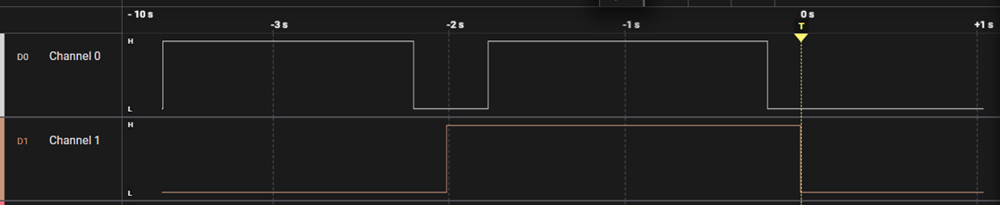

# GPIO Button Interrupt

This example demonstrates GPIO input interrupt handling on the STM32G071RB.

The user button is configured as an external interrupt source, and the LED state is updated inside the interrupt flow. This example is used to validate basic EXTI configuration, GPIO interrupt setup, and IRQ handling in the custom bare-metal GPIO driver.

## What This Example Covers

* GPIO input configuration
* GPIO output configuration
* EXTI interrupt configuration
* NVIC interrupt enable and priority setup
* GPIO interrupt callback flow

## Hardware

* Board: NUCLEO-G071RB
* Input: User button
* Output: On-board LED

## Logic Analyzer Capture

The logic analyzer capture below shows the signal transition generated by the button event.

## Notes

This example is intentionally simple and focuses only on GPIO interrupt behavior. It is part of the driver validation examples in this repository.
