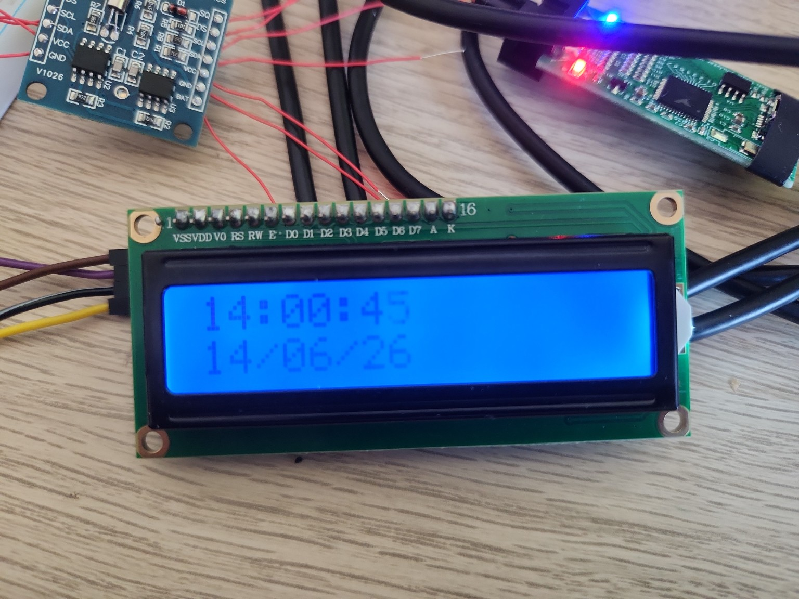
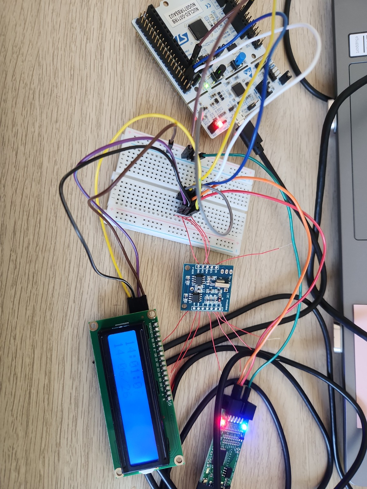
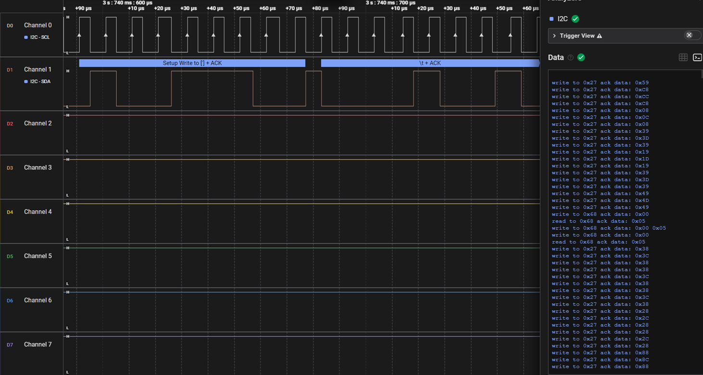

# I2C RTC LCD

This example combines a DS1307 RTC module and a 16x2 I2C LCD into a small working embedded application.

The STM32G071 reads the current time and date from the DS1307 over I2C and displays them on the LCD. Both modules share the same I2C bus.

## What This Example Covers

* I2C communication with multiple slave devices
* DS1307 RTC time/date read
* 16x2 LCD control through an I2C backpack
* BSP module usage
* SysTick-based periodic display update
* Logic analyzer validation of I2C traffic

## Hardware

* Board: NUCLEO-G071RB
* RTC module: DS1307
* Display: 16x2 I2C LCD
* Peripheral: I2C1
* Pins:

  * PB8 → I2C1_SCL
  * PB9 → I2C1_SDA

## I2C Devices

| Device       | I2C Address | Description                     |
| ------------ | ----------: | ------------------------------- |
| DS1307 RTC   |      `0x68` | Time and date source            |
| LCD backpack |      `0x27` | PCF8574-based I2C LCD interface |

## Project Flow

1. Initialize the DS1307 RTC.
2. Initialize the I2C LCD.
3. Read time and date from the RTC.
4. Convert the RTC values into display strings.
5. Update the LCD once per second using a SysTick flag.

## Demo

The LCD displays the current time on the first line and the current date on the second line.

## Hardware Setup

The DS1307 RTC and the LCD backpack are connected to the same I2C1 bus.

## Logic Analyzer Capture

The capture below shows both I2C slave devices on the same bus:

* `0x68` — DS1307 RTC
* `0x27` — LCD I2C backpack

## Notes

The RTC time/date can be set once from firmware, then the set-time lines should be commented out so the DS1307 continues running from its backup battery.

This example was used as a small integration project after implementing the GPIO, I2C, RCC, SysTick, DS1307 and LCD modules.
